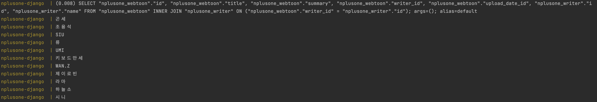
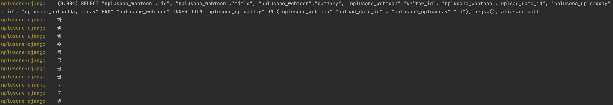
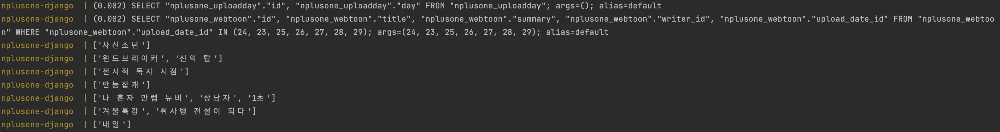
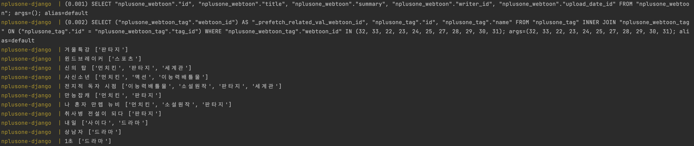
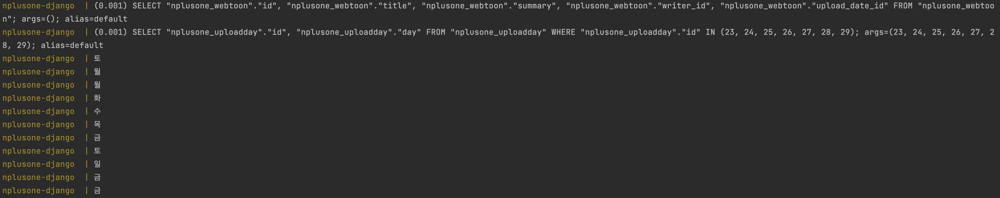

# N+1
외래키를 사용해서 데이터를 가져올 때 발생하는 현상이다. N+1이라고 해서 N개의 쿼리를 사용해야 하는데 1개가 더 보내지는 문제인지 알았는데, 알아보니 1개의 쿼리를 사용해서 가져올 수 있는 걸 N번 더 날려서 발생하는 것이였다.

### ERD


## N+1 발생 조건
### 1️⃣ 1:1 관계 테이블의 데이터 가져올 때
```python
for webtoon in WebToon.objects.all():
	print(webtoon.writer.name)
```

### 2️⃣ 1:N 관계 중 N의 데이터 가져올 때
```python
for webtoon in WebToon.objects.all():
    print(webtoon.upload_date.day)
```


### 3️⃣ 1:N 관계 중 1의 데이터 가져올 때
```python
for upload_day in UploadDay.objects.all():
    print([day.title for day in upload_day.webtoon_set.all()])
```


### 4️⃣ N:M 관계 테이블의 데이터 가져올 때
```python
for webtoon in WebToon.objects.all():
    print(webtoon.title, [tag.name for tag in webtoon.tag.all()])
```


## N+1 해결
Django ORM의 Eager Loading 방식인 `select_related()` 와 `prefetch_related()` 를 사용해서 해결할 수 있다.

### 1️⃣ `select_related()` 사용
#### 1:1 관계 테이블 가져오기
```python
for webtoon in WebToon.objects.all().select_related('writer'):
    print(webtoon.writer.name)
```


#### 1:N 관계 중 N 가져오기
```python
for webtoon in WebToon.objects.all().select_related('upload_date'):
    print(webtoon.upload_date.day)
```


### 2️⃣ `prefetch_related()` 사용
#### 1:N 관계 중 1 가져오기
```python
for upload_day in UploadDay.objects.all().prefetch_related('webtoon_set'):
    print([day.title for day in upload_day.webtoon_set.all()])
```


#### N:M 관계 테이블 가져오기
```python
for webtoon in WebToon.objects.all().prefetch_related('tag'):
    print(webtoon.title, [tag.name for tag in webtoon.tag.all()])
```


# select_related()와 prefetch_related()
django에서 하나의 QuerySet을 가져올 때 연관되어 있는 Object를 미리 불러오게 하는 함수이다. Join을 사용하기 때문에 SQL문이 복잡해질 수도 있지만, 중복 호출을 방지할 수 있어 퍼포먼스를 높일 수 있다.

## select_related()
1:1 관계, 1:N 관계에서 N이 사용할 수 있다. 즉, 정방향 참조에서 사용할 수 있다는 말이다.


## prefetch_related()
1:1 관계, 1:N 관계에서 N 뿐만 아니라 1:N 관계에서 1이, N:M 관계에서도 사용할 수 있다.

위의 사진을 유심히 보면 select_related()와 다르게 쿼리가 하나 더 실행된 걸 확인할 수 있다. 첫 번째 쿼리는 webtoon의 정보를 위한 쿼리고, 두 번째 쿼리는 prefetch_related() 에 작성한 역방향 필드에 대한 추가 쿼리다.

## select_related() vs prefetch_related()
- select_related()는 Join을 사용해서 데이터를 가져오고, prefetch_related()는 추가 쿼리로 데이터를 가져와 파이썬 레벨에서 데이터를 Join 시킨다.
- select_related()는 정방향에서, prefetch_related()는 역방향에서 유용하게 사용된다.

select_related()와 prefetch_related()에 대한 기본 개념은 알겠는데 아직은 심화 레벨까지 이해하진 못했다. 더 사용해보면서 익혀야겠다.


