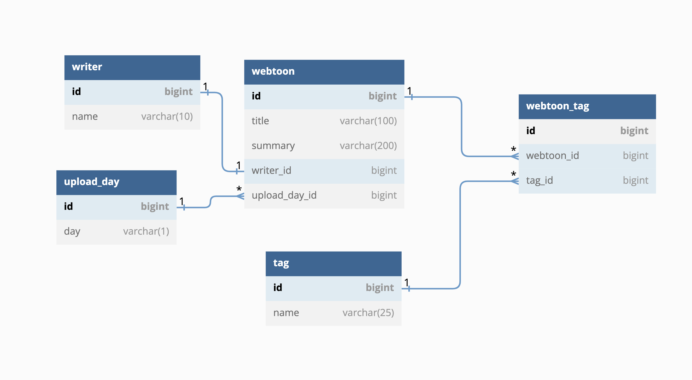
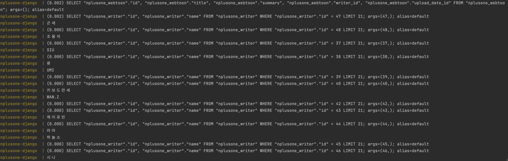
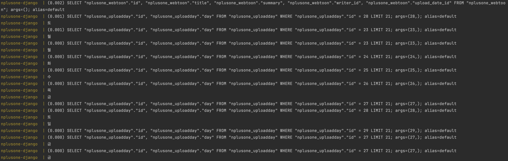
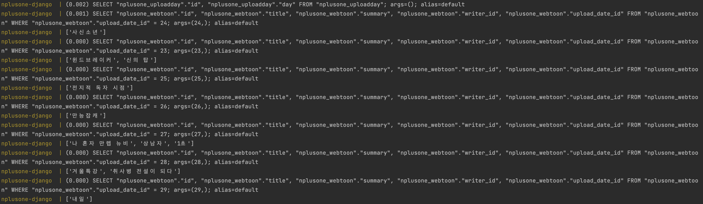
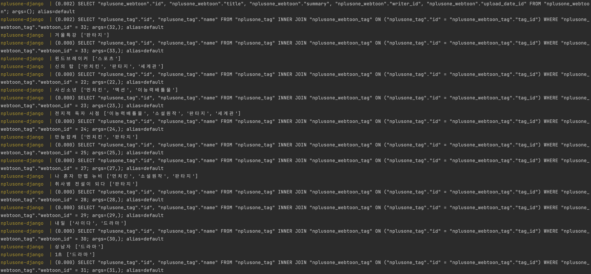

# N+1
외래키를 사용해서 데이터를 가져올 때 발생하는 현상이다. N+1이라고 해서 N개의 쿼리를 사용해야 하는데 1개가 더 보내지는 문제인지 알았는데, 알아보니 1개의 쿼리를 사용해서 가져올 수 있는 걸 N번 더 날려서 발생하는 것이였다.

### ERD


## N+1 발생 조건
### 1️⃣ 1:1 관계 테이블의 데이터 가져올 때
```python
for webtoon in WebToon.objects.all():
	print(webtoon.writer.name)
```

### 2️⃣ 1:N 관계 중 N의 데이터 가져올 때
```python
for webtoon in WebToon.objects.all():
    print(webtoon.upload_date.day)
```


### 3️⃣ 1:N 관계 중 1의 데이터 가져올 때
```python
for upload_day in UploadDay.objects.all():
    print([day.title for day in upload_day.webtoon_set.all()])
```


### 4️⃣ N:M 관계 테이블의 데이터 가져올 때
```python
for webtoon in WebToon.objects.all():
    print(webtoon.title, [tag.name for tag in webtoon.tag.all()])
```

